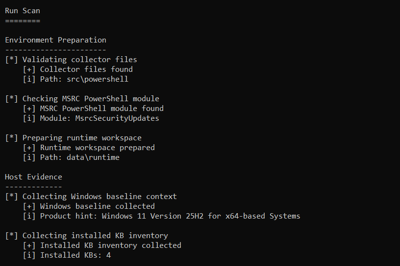
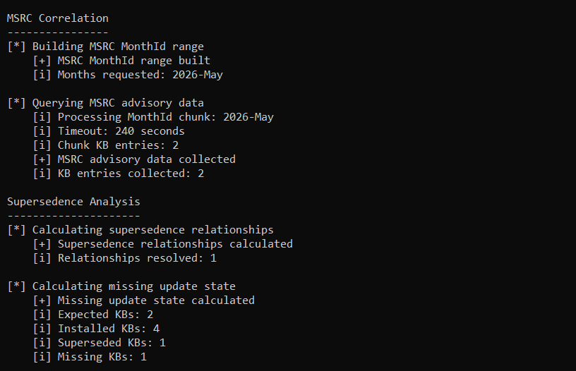
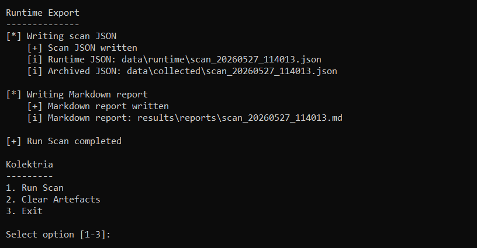
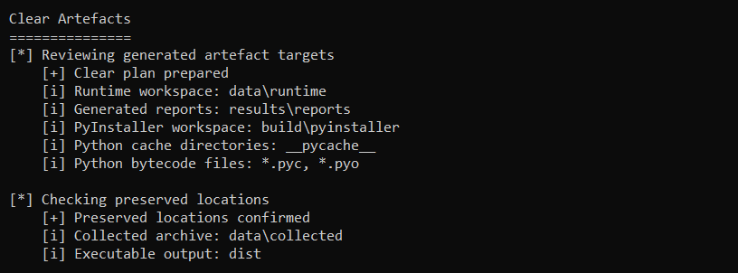
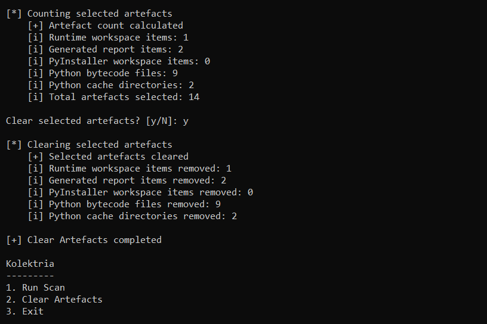
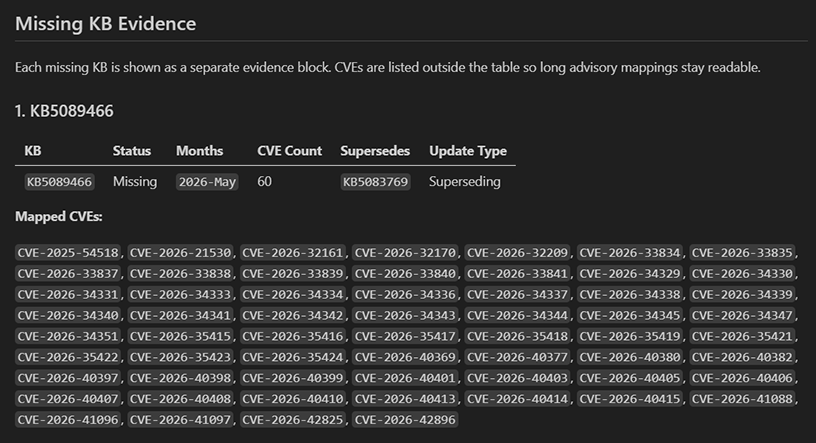
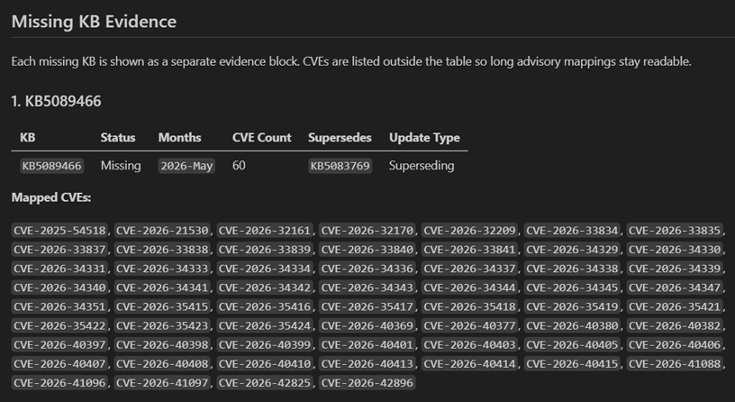

# Kolektria

**Collects Windows KB, MSRC, and supersedence evidence from authorised hosts, then exports structured JSON and Markdown reports for Remetria analysis.**

Kolektria is a portable Windows patch-state collector built for authorised host review, lab testing, dissertation evidence collection, and portfolio demonstration. It gathers non-identifying Windows update-state data, maps expected Microsoft security updates through MSRC advisory data, resolves supersedence relationships, identifies missing KBs, and exports reviewable artefacts for downstream analysis.

The project addresses a practical vulnerability management problem:

> Windows patching is package-driven through KB updates, while vulnerability analysis is CVE-driven. Kolektria connects those views by turning local update state into structured KB, CVE, MonthId, and supersedence evidence.

Kolektria is designed as the collection layer for Remetria. It does not score risk by itself and does not replace enterprise patch management tooling. Its role is to produce clean, repeatable, privacy-conscious patch-state evidence that can be reviewed directly or analysed later.

---

## Purpose

Kolektria focuses on reliable evidence collection rather than prioritisation. The tool collects local Windows update context, correlates expected KBs with MSRC advisory data, applies supersedence logic, and produces scan artefacts that can be reviewed directly or passed into Remetria.

• **Patch-State Collection**  
  Collects Windows baseline context and installed KB inventory from authorised hosts using PowerShell collectors.

• **MSRC Correlation**  
  Queries Microsoft Security Response Center data by MonthId and product hint to map expected KBs to CVEs and supersedence relationships.

• **Missing-KB Evidence**  
  Compares installed KBs against expected advisory KBs after supersedence expansion, distinguishing installed, superseded, and missing update state.

• **Structured Output**  
  Exports timestamped JSON under `data/runtime/`, preserves archived copies under `data/collected/`, and writes Markdown reports under `results/reports/`.

• **Portable Operation**  
  Includes a packaged executable under `dist/` and a Windows launcher so the tool can be copied to USB and run through `kolektria.bat`.

• **Privacy-Conscious Scope**  
  Avoids hostname, username, serial number, IP address, MAC address, domain, installed applications, local file paths, and user activity.

---

## Screenshots

The screenshots below show Kolektria from launch through scan execution, MSRC correlation, supersedence analysis, runtime export, artefact clearing, and Markdown reporting.

### Operator Menu


The operator menu provides a simple entry point for running a scan, clearing generated artefacts, or exiting the tool. The banner is shown once at startup, while later menu returns use the compact Kolektria title.

### Run Scan - Host Evidence



The scan workflow starts by validating required collector files, checking the MSRC PowerShell module, preparing the runtime workspace, collecting Windows baseline context, and recording installed KB inventory.

### Run Scan - MSRC Correlation And Supersedence



Kolektria builds the MSRC MonthId range, queries advisory data, maps KB entries, resolves supersedence relationships, and calculates the missing update state.

### Run Scan - Runtime Export



The runtime export writes a timestamped scan JSON file, stores an archived copy, generates a Markdown report, and returns to the main menu after the scan completes.

### Clear Artefacts



The clear workflow reviews generated artefact targets, confirms preserved locations, counts selected artefacts, and asks for confirmation before cleanup proceeds.



After confirmation, Kolektria clears selected generated artefacts while preserving the collected scan archive and executable output.

### Markdown Report - Missing Update State



The Markdown report presents the update-state calculation as expected, installed, superseded, and missing KB sets, with explanations for each state.

### Markdown Report - Missing KB Evidence



Each missing KB is shown as a separate evidence block with status, MonthId coverage, CVE count, supersedence context, update type, and mapped CVEs.

---

## Technical Capabilities

Kolektria is built as a small Windows collection workflow with clear separation between launcher, Python orchestration, PowerShell evidence collection, reporting, cleanup, and shared utilities.

| Area | Implementation |
|---|---|
| Core Stack | Python, PowerShell, JSON artefacts, Markdown reporting, PyInstaller executable output, repository-relative paths, and Windows batch launching. |
| Windows Collection | PowerShell scripts collect baseline context, installed KB inventory, MSRC product hints, and advisory mappings. |
| MSRC Mapping | The MSRC PowerShell module queries CVRF data and maps KBs to CVEs, MonthIds, and supersedence relationships. |
| Supersedence Logic | Installed KBs are expanded through supersedence relationships to identify updates that are physically installed, logically covered, or missing. |
| Runtime Artefacts | Timestamped scan JSON is written to `data/runtime/` and copied to `data/collected/` as a preserved archive. |
| Markdown Reporting | Reports summarise scan outcome, KB state, missing KB evidence, baseline evidence, method, and scope. |
| Artefact Clearing | Generated runtime files, reports, PyInstaller build output, and Python cache files can be cleared from the menu with confirmation. |
| Packaged Execution | `dist/kolektria.exe` provides the packaged Python application, while `kolektria.bat` is the intended user entry point. |

---

## Architecture

The repository separates packaged execution, Python application modules, shared utilities, PowerShell collectors, generated data, preserved scan output, reports, samples, screenshots, and build files.

```text
kolektria.bat
│   Launches Kolektria from the repository root.
│   Handles Windows checks, elevation, executable mode, Python fallback,
│   and final console hold.
│
build/
│   └── build_exe.bat
│       Builds the packaged executable with PyInstaller.
│
dist/
│   └── kolektria.exe
│       Packaged Kolektria executable used by the launcher.
│
data/
├── runtime/
│   Stores the latest generated scan JSON.
│
└── collected/
    Stores archived scan JSON copies preserved across cleanup.
│
docs/
└── screenshots/
    Stores README and portfolio screenshots.
│
results/
└── reports/
    Stores generated Markdown scan reports.
│
samples/
├── sample_scan.json
│   Example scan output.
│
└── sample_report.md
    Example Markdown report output.
│
src/
├── kolektria/
│   ├── __init__.py
│   ├── collector.py
│   │   Provides the interactive menu, scan workflow, MSRC correlation,
│   │   supersedence calculation, runtime export, and report trigger.
│   │
│   ├── cleaner.py
│   │   Reviews and clears generated artefacts while preserving archived scans
│   │   and executable output.
│   │
│   └── reporter.py
│       Builds Markdown evidence reports from scan JSON.
│
├── powershell/
│   ├── baseline.ps1
│   │   Collects Windows baseline and update-state context.
│   │
│   ├── inventory.ps1
│   │   Collects installed KB inventory.
│   │
│   └── adapter.ps1
│       Queries MSRC advisory data and maps KBs, CVEs, MonthIds,
│       and supersedence relationships.
│
└── utils/
    ├── __init__.py
    ├── console.py
    │   Provides banner, menu, action, section, and status output helpers.
    │
    ├── dependencies.py
    │   Checks and bootstraps the MSRC PowerShell module.
    │
    ├── paths.py
    │   Centralises repository-relative paths and required file checks.
    │
    └── runner.py
        Runs PowerShell scripts non-interactively and parses JSON output.
```

Each layer communicates through structured dictionaries, PowerShell JSON output, timestamped JSON files, or Markdown reports. Generated artefacts are kept separate from source code so the collection workflow remains reviewable and repeatable.

---

## Workflow

Kolektria follows a direct evidence chain from local update state to scan artefacts.

```text
Run Scan -> Baseline Collection -> Installed KB Inventory -> MSRC Correlation -> Supersedence Analysis -> JSON Export -> Markdown Report
```

The menu also includes controlled artefact clearing:

```text
Clear Artefacts -> Review Targets -> Confirm Preserved Locations -> Count Artefacts -> Confirm Cleanup -> Remove Generated Files
```

---

## Operation

Kolektria is intended to be launched through the Windows batch file from the repository root.

```bat
kolektria.bat
```

The launcher uses the packaged executable first:

```text
dist/kolektria.exe
```

If the executable is missing and Python is available, the launcher can fall back to source mode.

| Action | Behaviour |
|---|---|
| Run Scan | Validates required files, checks the MSRC module, prepares the runtime workspace, collects baseline and inventory evidence, queries MSRC advisory data, resolves supersedence, exports scan JSON, archives a copy, and writes a Markdown report. |
| Clear Artefacts | Reviews generated artefact targets, preserves archived scans and executable output, prompts before deletion, and clears runtime output, reports, PyInstaller build files, and Python cache files. |
| Exit | Leaves the menu cleanly. |

Generated artefacts are stored in predictable project-relative locations:

• **Latest Runtime Scan**  
  Stored in `data/runtime/` as timestamped JSON.

• **Archived Scan Copy**  
  Stored in `data/collected/` and preserved during cleanup.

• **Markdown Report**  
  Stored in `results/reports/`.

• **Sample Output**  
  Stored in `samples/` for documentation and review.

---

## USB / Portable Use

For portable testing, copy the project folder to a USB drive and run the launcher from the folder root.

Required portable structure:

```text
Kolektria/
├── kolektria.bat
├── dist/
│   └── kolektria.exe
├── src/
│   └── powershell/
│       ├── adapter.ps1
│       ├── baseline.ps1
│       └── inventory.ps1
├── data/
│   ├── runtime/
│   └── collected/
└── results/
    └── reports/
```

Run:

```bat
kolektria.bat
```

The executable packages the Python application, but the PowerShell collector scripts remain external and must be present under `src/powershell/`. This keeps the collection layer visible and easy to inspect.

---

## Build

The repository includes the packaged executable for straightforward review and portable operation. Rebuilding is only needed after source changes or when verifying the executable build process.

Build from the repository root:

```bat
build\build_exe.bat
```

The build script uses PyInstaller and writes:

```text
dist/kolektria.exe
```

Build output policy:

| Path | Role |
|---|---|
| `build/build_exe.bat` | Committed build helper used to rebuild the executable. |
| `build/pyinstaller/` | Temporary PyInstaller working directory cleared by Clear Artefacts. |
| `dist/kolektria.exe` | Packaged executable used by `kolektria.bat`. |
| `*.spec` | Generated PyInstaller spec files are not maintained unless a custom package definition is added later. |

Install build dependencies if needed:

```bat
python -m pip install -r requirements.txt
```

---

## Technical Method

Kolektria uses PowerShell for Windows update-state collection and Python for orchestration, dependency checks, supersedence handling, output control, cleanup, reporting, and executable packaging.

• **Baseline Collection**  
  `baseline.ps1` collects Windows OS name, edition, display version, build, architecture, LCU MonthId, lower-precision update timing, MSRC latest MonthId, resolved product MonthId, and product hint.

• **Inventory Collection**  
  `inventory.ps1` collects installed KB identifiers from Windows update sources and normalises them into a stable inventory list.

• **MSRC Correlation**  
  `adapter.ps1` queries MSRC CVRF data for requested MonthIds and a resolved Windows product hint, then returns KB entries with mapped CVEs and supersedence relationships.

• **Supersedence Analysis**  
  Installed KBs are expanded through supersedence relationships so older KBs can be treated as logically covered where a superseding update is installed.

• **Report Generation**  
  `reporter.py` creates a Markdown evidence report with scan outcome, KB state, missing KB evidence, baseline evidence, method, and scope notes.

• **Artefact Clearing**  
  `cleaner.py` removes generated runtime files, reports, PyInstaller build output, and Python cache artefacts after confirmation, while preserving archived scan data and executable output.

---

## Setup

Kolektria is Windows-focused because it collects local Windows update state through PowerShell.

| Requirement | Detail |
|---|---|
| Windows | Required for local update-state collection. |
| PowerShell | Required for baseline, inventory, and MSRC adapter scripts. |
| Administrator Prompt | Recommended and expected for complete Windows package visibility. |
| Internet Access | Required for MSRC advisory queries and first-time MSRC module installation. |
| MSRC PowerShell Module | Checked and installed by Kolektria when missing. |
| Python | Required only for source-mode execution or rebuilding the executable. |
| PyInstaller | Required only when rebuilding the executable. |

Run packaged mode:

```bat
kolektria.bat
```

Run source mode:

```powershell
$env:PYTHONPATH = "$PWD\src"
python -m kolektria.collector
```

Rebuild executable:

```bat
build\build_exe.bat
```

---

## Project Status

Current status: **functional lab implementation**.

• **Implemented Workflow**  
  Kolektria currently includes the Windows launcher, packaged executable, interactive menu, scan workflow, MSRC dependency check, PowerShell collection, supersedence analysis, JSON export, Markdown reporting, and artefact clearing.

• **Evidence Scope**  
  The collector produces non-identifying Windows update-state and advisory-mapping evidence suitable for authorised lab testing and downstream dissertation analysis.

• **Remetria Role**  
  Kolektria is the collection layer. Remetria is intended to handle downstream prioritisation, comparison, and research analysis.

• **Portable Review**  
  The repository includes a packaged executable so the tool can be launched through `kolektria.bat` without requiring reviewers to build it first.

• **Future Development**  
  Future improvements could include a dedicated release ZIP layout, richer sample fixtures, optional CSV export, clearer report filtering, pinned test data, or deeper validation around MSRC module/network failures.

---

## Limitations

Kolektria reports local Windows patch-state evidence and MSRC-derived advisory mappings. It does not prove exploitability, decide remediation priority by itself, or replace enterprise patch management.

• **Authorised Use**  
  Kolektria should only be run on systems the operator is authorised to assess.

• **MSRC Dependency**  
  Advisory mapping depends on the MSRC PowerShell module, internet access, available CVRF data, correct MonthIds, and product matching.

• **Windows Focus**  
  The current collection workflow is Windows-focused and is not cross-platform.

• **Local Evidence Scope**  
  Kolektria avoids personal or user-identifying data, but it still records update-state information from the local host.

• **No Risk Ranking**  
  Kolektria identifies missing KB evidence. Risk prioritisation is handled downstream by Remetria.

• **Executable Scope**  
  The packaged executable contains the Python application. The PowerShell collector scripts are intentionally kept external under `src/powershell/`.

• **Supersedence Interpretation**  
  Supersedence logic helps identify logically covered KBs, but update applicability should still be reviewed before remediation decisions.

---

## Licence

MIT License. See `LICENSE`.
