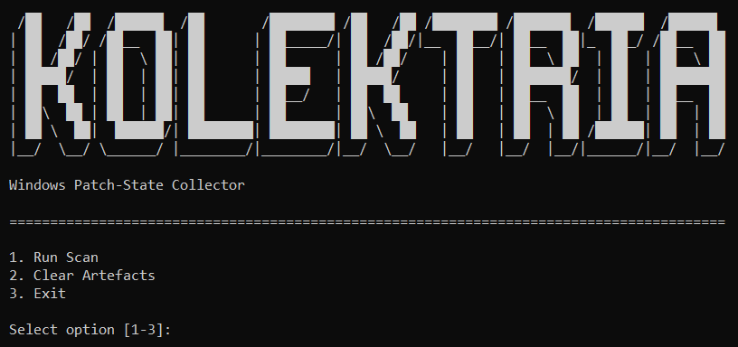

# Kolektria

**Collects Windows KB, MSRC, and supersedence evidence from authorised hosts, then exports structured JSON and Markdown reports for Remetria analysis.**

Kolektria is a portable Windows patch-state collector built for authorised host review, lab testing, and dissertation evidence collection. It gathers non-identifying Windows update-state data, maps expected Microsoft security updates through MSRC advisory data, resolves supersedence relationships, identifies missing KBs, and exports reviewable artefacts for downstream analysis.

The project addresses a practical vulnerability management problem:

> Windows patching is package-driven through KB updates, while vulnerability analysis is CVE-driven. Kolektria connects those views by turning local update state into structured KB, CVE, MonthId, and supersedence evidence.

Kolektria is designed as the collection layer for Remetria. It does not score risk by itself and does not replace enterprise patch management tooling. Its role is to produce clean, repeatable, privacy-conscious patch-state evidence that can be analysed later.

---

## Purpose

Kolektria focuses on reliable evidence collection rather than prioritisation. The tool collects local Windows update context, correlates expected KBs with MSRC advisory data, applies supersedence logic, and produces scan artefacts that can be reviewed directly or passed into Remetria.

• **Patch-State Collection**  
  Kolektria collects Windows baseline context and installed KB inventory from authorised hosts using PowerShell collectors.

• **MSRC Correlation**  
  The collector queries Microsoft Security Response Center data by MonthId and product hint to map expected KBs to CVEs and supersedence relationships.

• **Missing-KB Evidence**  
  Installed KBs are compared against expected advisory KBs after supersedence expansion, allowing Kolektria to distinguish missing, installed, and logically covered update state.

• **Structured Output**  
  Each scan exports timestamped JSON under `data/runtime/`, preserves an archived copy under `data/collected/`, and writes a readable Markdown report under `results/reports/`.

• **Privacy-Conscious Scope**  
  Kolektria avoids collecting hostname, username, serial number, IP address, MAC address, domain, installed applications, local file paths, or user activity.

---

## Screenshots

Screenshots should be stored in `docs/screenshots/` and referenced here once the final interface and report output are locked.

### Operator Menu



The operator menu provides a simple entry point for running a scan, clearing generated artefacts, or exiting the tool.

### Run Scan


The scan workflow validates collector files, checks the MSRC PowerShell module, collects host evidence, queries MSRC advisory data, resolves supersedence, and exports JSON and Markdown evidence.

### Clear Artefacts


The cleanup workflow reviews generated artefact targets, confirms preserved locations, counts selected artefacts, prompts before deletion, and preserves archived scans and executable output.

### Markdown Report


The Markdown report summarises scan outcome, missing update state, missing KB evidence, baseline evidence, method, and collection scope.

---

## Technical Capabilities

Kolektria is built as a small Windows collection workflow with clear separation between launcher, Python orchestration, PowerShell evidence collection, reporting, cleanup, and shared utilities.

| Area | Implementation |
|---|---|
| Core Stack | Python, PowerShell, JSON artefacts, Markdown reporting, repository-relative paths, and Windows batch launching. |
| Windows Collection | PowerShell scripts collect baseline context, installed KB inventory, MSRC product hints, and advisory mappings. |
| MSRC Mapping | The MSRC PowerShell module is used to query CVRF data and map KBs to CVEs, MonthIds, and supersedence relationships. |
| Supersedence Logic | Installed KBs are expanded through supersedence relationships to identify updates that are physically installed, logically covered, or missing. |
| Runtime Artefacts | Timestamped scan JSON is written to `data/runtime/` and copied to `data/collected/` as a preserved archive. |
| Markdown Reporting | Human-readable reports summarise scan outcome, KB state, missing KB evidence, baseline evidence, method, and scope. |
| Artefact Cleanup | Generated runtime files, reports, PyInstaller build output, and Python cache files can be cleared from the menu with confirmation. |
| Launcher Flow | `kolektria.bat` handles elevation, PowerShell checks, Python fallback, executable launch, and final console hold. |

---

## Architecture

The repository separates the Python application modules, shared utilities, PowerShell collectors, generated data, preserved scan output, reports, samples, and build files.

```text
kolektria.bat
│   Launches Kolektria from the repository root.
│   Handles Windows checks, elevation, executable mode, and Python fallback.
│
build/
│   Stores PyInstaller build configuration and build helper files.
│
data/
├── runtime/
│   Stores the latest generated scan JSON.
│
├── collected/
│   Stores archived scan JSON copies preserved across cleanup.
│
docs/
├── screenshots/
│   Stores README and portfolio screenshots.
│
results/
├── reports/
│   Stores generated Markdown scan reports.
│
samples/
│   Stores sample scan output for review and documentation.
│
src/
├── kolektria/
│   ├── collector.py
│   │   Provides the interactive menu, scan workflow, MSRC correlation,
│   │   supersedence calculation, runtime export, and report trigger.
│   │
│   ├── cleaner.py
│   │   Reviews and clears generated artefacts while preserving archived scans
│   │   and executable output.
│   │
│   └── reporter.py
│       Builds Markdown evidence reports from scan JSON.
│
├── powershell/
│   ├── baseline.ps1
│   │   Collects Windows baseline and update-state context.
│   │
│   ├── inventory.ps1
│   │   Collects installed KB inventory.
│   │
│   └── adapter.ps1
│       Queries MSRC advisory data and maps KBs, CVEs, MonthIds,
│       and supersedence relationships.
│
└── utils/
    ├── console.py
    │   Provides banner, menu, section, and status output helpers.
    │
    ├── dependencies.py
    │   Checks and bootstraps the MSRC PowerShell module.
    │
    ├── paths.py
    │   Centralises repository-relative paths and required file checks.
    │
    └── runner.py
        Runs PowerShell scripts non-interactively and parses JSON output.
```

Each layer communicates through structured dictionaries, PowerShell JSON output, timestamped JSON files, or Markdown reports. Generated artefacts are kept separate from source code so the collection workflow remains reviewable and repeatable.

---

## Workflow

Kolektria follows a direct evidence chain from local update state to scan artefacts.

```text
Run Scan -> Baseline Collection -> Installed KB Inventory -> MSRC Correlation -> Supersedence Analysis -> JSON Export -> Markdown Report
```

The menu also includes cleanup for generated artefacts:

```text
Clear Artefacts -> Review Targets -> Confirm Preserved Locations -> Count Artefacts -> Confirm Cleanup -> Remove Generated Files
```

---

## Operation

Kolektria is intended to be launched through the Windows batch file from the repository root.

```bat
kolektria.bat
```

The menu provides three actions:

| Action | Behaviour |
|---|---|
| Run Scan | Validates required files, checks the MSRC module, prepares the runtime workspace, collects baseline and inventory evidence, queries MSRC advisory data, resolves supersedence, exports scan JSON, archives a copy, and writes a Markdown report. |
| Clear Artefacts | Reviews generated artefact targets, preserves archived scans and executable output, prompts before deletion, and clears runtime output, reports, PyInstaller build files, and Python cache files. |
| Exit | Leaves the menu cleanly. |

Generated artefacts are stored in predictable project-relative locations:

• **Latest Runtime Scan**  
  Stored in `data/runtime/` as timestamped JSON.

• **Archived Scan Copy**  
  Stored in `data/collected/` and preserved during cleanup.

• **Markdown Report**  
  Stored in `results/reports/`.

• **Sample Output**  
  Stored in `samples/` for documentation and review.

---

## Technical Method

Kolektria uses PowerShell for Windows update-state collection and Python for orchestration, dependency checks, supersedence handling, output control, cleanup, and reporting.

• **Baseline Collection**  
  `baseline.ps1` collects Windows OS name, edition, display version, build, architecture, LCU MonthId, lower-precision update timing, MSRC latest MonthId, resolved product MonthId, and product hint.

• **Inventory Collection**  
  `inventory.ps1` collects installed KB identifiers from Windows update sources and normalises them into a stable inventory list.

• **MSRC Correlation**  
  `adapter.ps1` queries MSRC CVRF data for requested MonthIds and a resolved Windows product hint, then returns KB entries with mapped CVEs and supersedence relationships.

• **Supersedence Analysis**  
  Installed KBs are expanded through supersedence relationships so older KBs can be treated as logically covered where a superseding update is installed.

• **Report Generation**  
  `reporter.py` creates a Markdown evidence report with scan outcome, KB state, missing KB evidence, baseline evidence, method, and scope notes.

• **Artefact Cleanup**  
  `cleaner.py` removes generated runtime files, reports, PyInstaller build output, and Python cache artefacts after confirmation, while preserving archived scan data and executable output.

---

## Setup

Kolektria is Windows-focused because it collects local Windows update state through PowerShell. Python is used for orchestration and reporting.

| Requirement | Detail |
|---|---|
| Windows | Required for local update-state collection. |
| PowerShell | Required for baseline, inventory, and MSRC adapter scripts. |
| Administrator Prompt | Recommended and expected for complete Windows package visibility. |
| Python | Required for source-mode execution and executable building. |
| PyInstaller | Required only when building the executable. |
| MSRC PowerShell Module | Checked and installed by Kolektria when missing. |

Install Python build dependencies:

```bat
python -m pip install -r requirements.txt
```

Launch the tool:

```bat
kolektria.bat
```

For source-mode testing:

```powershell
$env:PYTHONPATH = "$PWD\src"
python -m kolektria.collector
```

---

## Project Status

Current status: **functional lab implementation**.

• **Implemented Workflow**  
  Kolektria currently includes the Windows launcher, interactive menu, scan workflow, MSRC dependency check, PowerShell collection, supersedence analysis, JSON export, Markdown reporting, and artefact cleanup.

• **Evidence Scope**  
  The collector produces non-identifying Windows update-state and advisory-mapping evidence suitable for authorised lab testing and downstream dissertation analysis.

• **Remetria Role**  
  Kolektria is the collection layer. Remetria is intended to handle downstream prioritisation, comparison, and research analysis.

• **Future Development**  
  Future improvements could include packaged release folders, richer sample fixtures, optional CSV export, clearer report filtering, pinned test data, or deeper validation around MSRC module/network failures.

---

## Limitations

Kolektria reports local Windows patch-state evidence and MSRC-derived advisory mappings. It does not prove exploitability, decide remediation priority by itself, or replace enterprise patch management.

• **Authorised Use**  
  Kolektria should only be run on systems the operator is authorised to assess.

• **MSRC Dependency**  
  Advisory mapping depends on the MSRC PowerShell module, internet access, available CVRF data, correct MonthIds, and product matching.

• **Windows Focus**  
  The current collection workflow is Windows-focused and is not cross-platform.

• **Local Evidence Scope**  
  Kolektria avoids personal or user-identifying data, but it still records update-state information from the local host.

• **No Risk Ranking**  
  Kolektria identifies missing KB evidence. Risk prioritisation is handled downstream by Remetria.

• **Supersedence Interpretation**  
  Supersedence logic helps identify logically covered KBs, but update applicability should still be reviewed before remediation decisions.

---

## Licence

MIT License. See `LICENSE`.
